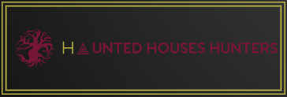

## Description
The Second milestone project from the Full Stack Developer course with Code Institute.
One or two paragraphs providing an overview of your project. Essentially, this part is your sales pitch.

The project is made based on the second module of the course that covers HTML, CSS, JavaScript. It also uses Jquery, Google Maps API and EmailJS

----

## UX/UI 
List your user stories, explain what they are looking for on your website.

* Fonts Used        
The site only uses 2 font families. The idea was to use something according to 
the site topic, within vintage/horror lines. So the fonts chosen were:         
    1. monospace (as it looks like text written from old typewritter, it provides clarity to the 
    text and nice natural letter spacing easy to read).  Used for all texts    
    2. Jessen Cicero (external webfont as none of the usual ones matched the criteria) it gives a look 
    half way among vintage and horror. Used on text headings, navigation menu and buttons.

* Color palette used        
Only 4 plane colours have been used in the site for consistency. The only variation has been in opacity for some cases.     
#8d0134 red     
#c0b43c gold        
#fbf8f2 whitish     
#231f20 blackish

* Layouts explain why you laid things out the way you did. 

* Wireframes mockups.       
As part of the design process I've used Balsamiq wireframes tool to create and visualize an 
initial structure of what the site was going to be. 
These files are included as a pdf file in the project itself (in an separate directory wireframes folder). 
There has been several changes during the project development from what the initial wireframes were:        
    1. Hero image from houses.html was deleted as it created worse UI since this page contains the cards info 
    of all houses, which should be the main focus of the user and not get distracted with the big hero image.       
    2. The locations page, some text and image has been added later.

----

## Features
These are the different parts of the project, and describe each in a sentence or so.

<dl>
<dt>Existing Features</dt>

* Feature 1 - allows users X to achieve Y, by having them fill out Z
For some/all of your features, you may choose to reference the specific project files that implement them, although this is entirely optional.

      

<dt>Future development</dt>

* Styling the Google Map change default colors design so it better matches the vintage style or colors from the site.

* Adding more UI side effects with JQuery, like in the Slideshow that is currently made only with HTML and CSS with a very fixed paramethers creating some limitations
regarding positioning, styling with borders and resizing it in a more responsible and easier way.

</dl>

----

## Testing
This site was tested across multiple device screen sizes to ensure compatibility and responsiveness.

 go over all of your user stories from the UX section and ensure that they all work as intended, 
with the project providing an easy and straightforward way for the users to achieve their goals.

Validator for html code     
[https://validator.w3.org/]

Validator for css code      
[https://jigsaw.w3.org/css-validator/]

A particularly useful form for describing your testing process is via scenarios, such as:

Contact form:
Go to the "Contact Us" page
Try to submit the empty form and verify that an error message about the required fields appears
Try to submit the form with an invalid email address and verify that a relevant error message appears
Try to submit the form with all inputs valid and verify that a success message appears.
In addition, you should mention in this section how your project looks and works on different browsers and screen sizes.

Known problems      
discovered during your testing, even if you haven't addressed them yet.

----
## Deployment

Deployed using GitHub Pages using default publishing source, main branch, root folder.
This repository can be cloned to pull down a full copy of all the repository to create 
a local copy using command line.        
Here is how to do that: https://help.github.com/en/articles/cloning-a-repository 

----
## Technologies used
[HTML](https://html.spec.whatwg.org/multipage/) Basic structure for the site        
[CSS](https://www.w3.org/Style/CSS/Overview.en.html) Styling the website    
[Bootstrap](https://getbootstrap.com/) customize responsive mobile-first mainly used for grid structure and buttons      
[JavaScript](https://www.w3schools.com/js/) Site interaction. Google Maps      
[JQuery](https://jquery.com/) To simplify DOM manipulation. Readmore toggler      
[Google Maps API](https://cloud.google.com/maps-platform) Provide locations of the houses on world map for better user experience        
[EmailJS API](https://www.emailjs.com/) Setting email service to receive form messages sent from the contact.html page    
[Balsamiq wireframes](https://balsamiq.com/) Initial mockups UI design ideas for the site

----
## Resources used 
<dl>
<dt>Images:</dt>

* castle.jpg image.  
Licence. Cornell University's Institute for Digital Collections  
[Source Link](http://fantastic.library.cornell.edu/imagerecord.php?record=134)      
Used on Locations.html page

* castleinterior.png image.  
Licence. Cornell University's Institute for Digital Collections  
[Source Link](http://fantastic.library.cornell.edu/imagerecord.php?record=134)      
Used as background on index.html page

<dt>Fonts:</dt>

* Jessen Font Family.  
Licence. licensed under the SIL Open Font License. Copyright 2019 Gotico-Antiqua project authors (thomas.huot-marchand@anrt-type.fr)  
[Source Link](https://www.1001fonts.com/jessen-font.html)       
Used on navigation menu, buttons and text headings

<dt>Icons:</dt>

* gate.svg     
Licence. Icons on UXWing free to use any personal, commercial projects.         
[Source Link](https://uxwing.com/gate/)     
Used on google map as marker

* contact-icon.png      
Licence Shutterstock standard licence. Royalty-free stock vector created by AVA Bitter id 591497954     
[Source Link](https://www.shutterstock.com/image-vector/handdrawn-vintage-typewriter-writing-machine-publishing-591497954)      
Used in formulary on contact.html

<dt>Texts sources:</dt>

House1 Garden Reach. Location: Cheltenham, UK
[https://labitacoradelmiedo.wordpress.com/category/lugares-encantados/]
[https://www.spookyisles.com/was-the-chelthenham-poltergeist-the-real-woman-in-black/]
[https://en.wikipedia.org/wiki/]

House2 Boleskine House. Location: Foyers Scotland, UK
[https://www.abc.es/viajar/top/20141030/abci-casas-encantadas-fantasma-201410031336_8.html]     
[https://en.wikipedia.org/wiki/]

House3 Palazzo Dario. Venezia, Italy        
[https://www.abc.es/viajar/top/20141030/abci-casas-encantadas-fantasma-201410031336_8.html] page8       
[https://en.wikipedia.org/wiki/]

House4 Palacio de Linares. Madrid, Spain
[https://www.abc.es/viajar/top/20141030/abci-casas-encantadas-fantasma-201410031336_8.html] page10
[https://en.wikipedia.org/wiki/]

House5 Catacombs of Paris. Location: Paris, France      
[https://en.wikipedia.org/wiki/]

House6 Leap Castle. Location : Coolderry, Ireland       
[https://en.wikipedia.org/wiki/]

House7 Amityville House. Location: New York, USA
[https://www.abc.es/viajar/top/20141030/abci-casas-encantadas-fantasma-201410031336_8.html] page2       
[https://en.wikipedia.org/wiki/]

House8 LaLaurie Mansion. Location: New Orleans, USA
[https://www.abc.es/viajar/top/20141030/abci-casas-encantadas-fantasma-201410031336_8.html] page5
[https://es.wikipedia.org/wiki/Delphine_LaLaurie#Mansi%C3%B3n_LaLaurie]

House9 Isla de las Muñecas. Location : Mexico city
[https://es.wikipedia.org/wiki/Isla_de_las_mu%C3%B1ecas]

House10 Joelma Building. Location: Sao Paulo, Brazil
[https://traveltriangle.com/blog/haunted-places-in-brazil/]

House11 El Salto Hotel. Location: Tequendama, Colombia
[https://culturacolectiva.com/photography/the-most-haunted-spots-in-latin-america]

House 12 Keg Mansion, Toronto       
[https://www.readersdigest.ca/travel/canada/canadas-10-most-haunted-places/]

</dl>

